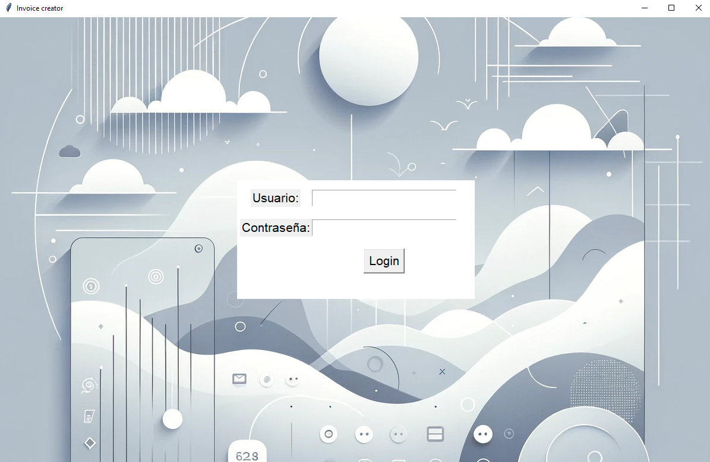
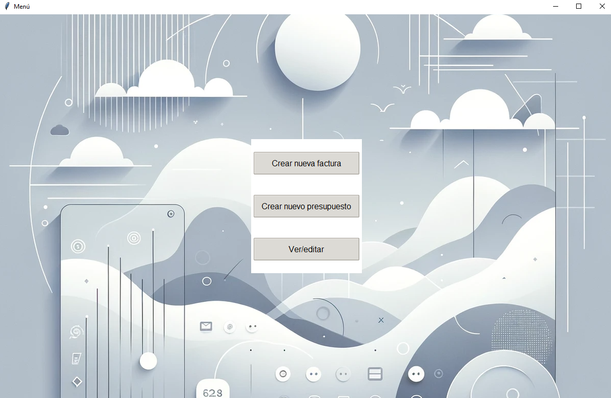
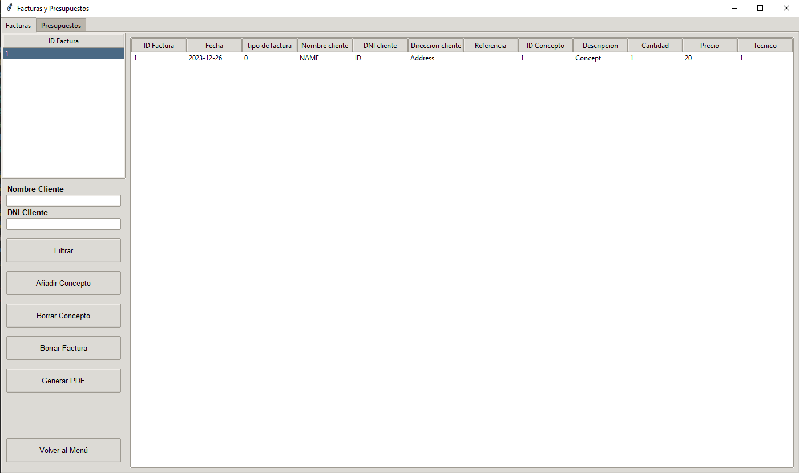
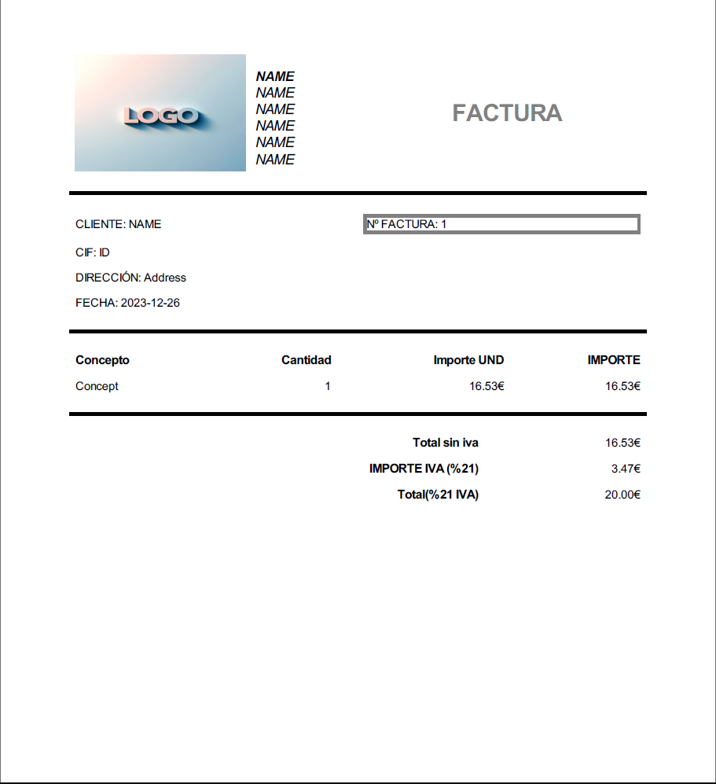

# Invoice and Budget Management Application

## Overview
This application provides a graphical user interface for managing invoices and budgets, featuring functionalities for creating and managing invoice items, generating invoices, and handling budget-related tasks.

## Features
- **User Authentication:** Secure login functionality.
- **Invoice Management:** Create and manage invoice items.
- **PDF Generation:** Generate invoices in PDF format.
- **Budget Management:** Manage budget-related tasks effectively.

## Setup

### Prerequisites
- `Python 3.x`
- `tkinter`
- `PySimpleGUI`
- Database setup compatible with the `database` module.

### Installation
Clone the repository or download the source code, then install the required Python packages:

```bash
pip install PySimpleGUI pdfkit jinja2
```

Ensure a compatible database setup as expected by the `database` module.

### Running the Application
Execute the script `gui.py`:

```bash
python gui.py
```

## Usage
After launching the application, log in with your credentials. Use the interface to manage invoices, create new budget items, and generate PDFs for record-keeping.

## Screenshots
Here are some screenshots of the application:




